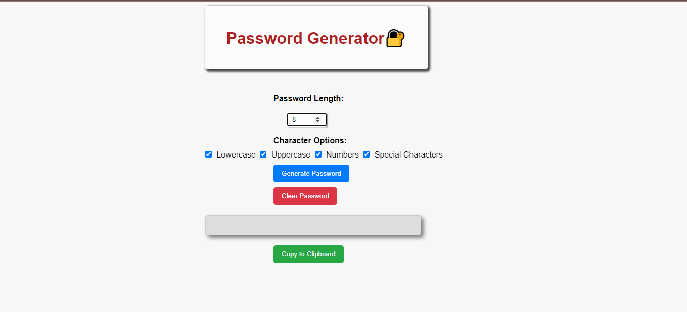
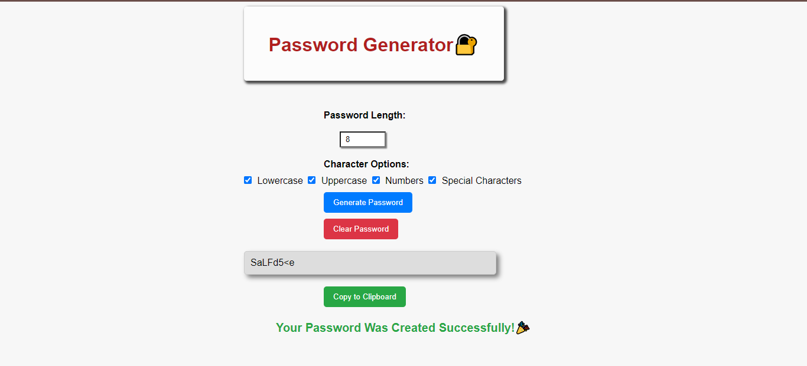

# Simple Password Generator

A straightforward web-based password generator that allows users to quickly generate strong and secure passwords with customization options.

## Features

- **Password Length:** Use a slider to choose the desired password length.
- **Character Options:** Include checkboxes for selecting character types (uppercase, lowercase, numbers, special characters).
- **Generate Button:** Click the "Generate Password" button to create a password based on the selected criteria.
- **Copy to Clipboard:** Easily copy the generated password to the clipboard.
- **Clear Password:** Clear the generated password.

## Technologies Used

- HTML 
- CSS
- JavaScript

## How to Use

1. Clone the repository to your local machine.
2. Open `index.html` in your web browser.
3. Adjust the password length and character options.
4. Click "Generate Password" to create a password.
5. Click "Copy to Clipboard" to copy the generated password.
6. Use the "Clear Password" button to remove the generated password.

## Acknowledgments

- This project was created as a simple exercise to practice JavaScript skills.

## Author

- [Aishwarya garje](https://github.com/aishwarya-garje)

